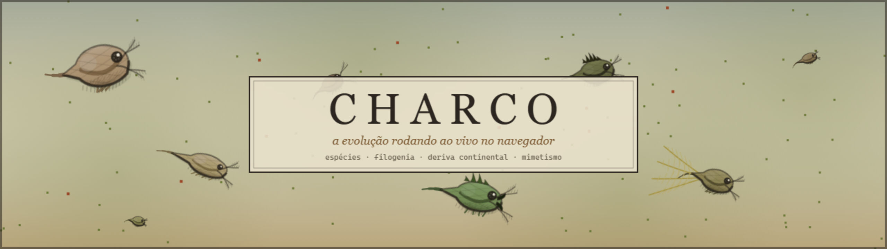
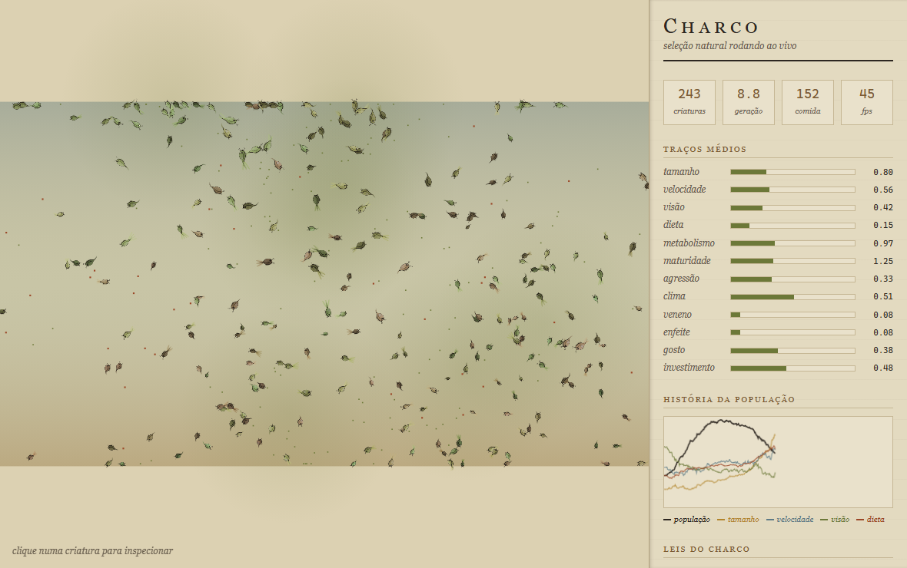
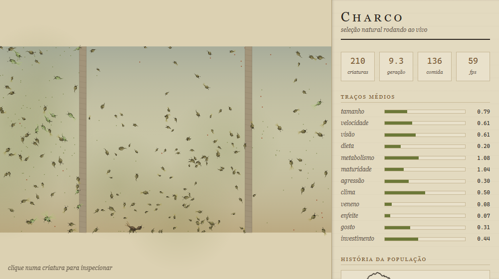
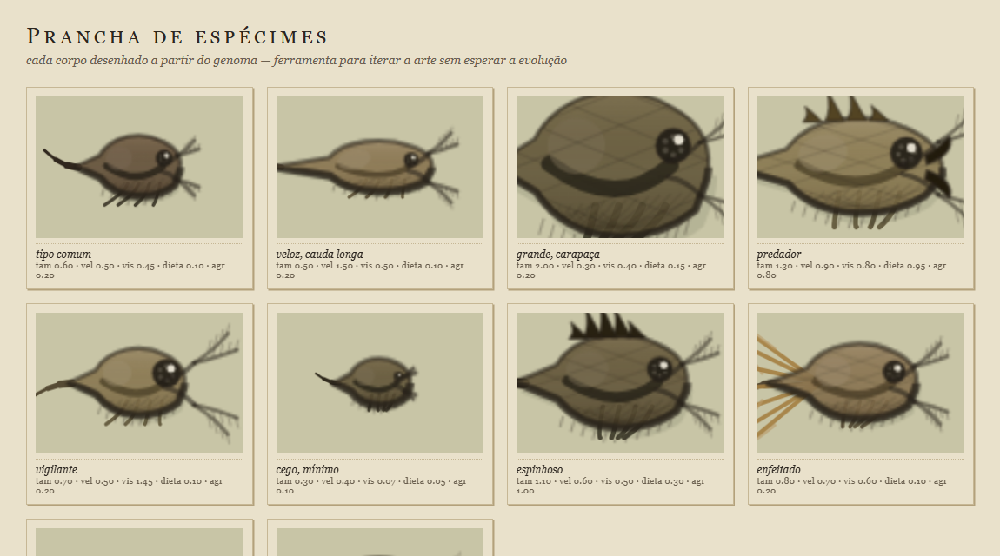

<p align="center">
  
</p>

<p align="center">
  
  
  
  
</p>

Criaturas têm genoma, gastam energia, caçam, escolhem parceiro, se reproduzem com
recombinação e morrem. Ninguém programou predador, herbívoro, migração, espécie,
aviso de veneno — nem o corpo dos bichos. Tudo isso **emerge**, e fica registrado.

**[O que emerge](#o-que-acontece-sem-ninguém-mandar)** ·
[O corpo é o genoma](#o-corpo-é-o-genoma) ·
[As leis do modelo](#as-leis-que-impedem-o-modelo-de-degenerar) ·
[O que NÃO emergiu](#o-que-não-emergiu) ·
[Arquitetura](#arquitetura) ·
[Estética](#estética)

---

## Isto não é roteiro. É o diário que o próprio programa escreveu:

```
   3s  novo pico populacional: 206 criaturas
 105s  os carnívoros tomaram o charco (14%)
 114s  gigantismo: o corpo médio passou de 1.15
 120s  colapso: de 397 para 163 criaturas
 143s  nova espécie: Phytodon placidus — separou-se de Phytodon herbarius
 274s  a onda carnívora passou — sobraram os herbívoros
 956s  MIMETISMO: os inofensivos copiaram a cor de quem é venenoso
1095s  APOSEMATISMO: os tóxicos convergiram todos para a mesma cor
```



<p align="center"><i>O painel inteiro é uma prancha: traços médios, história da
população, ficha do espécime com o cérebro dele desenhado, catálogo de espécies
vivas, árvore da vida, museu de fósseis e o diário.</i></p>

## Rodar

```bash
node serve.cjs        # http://localhost:8099
```

Ou abra o `index.html` direto. É tudo módulo ES: **sem build, sem npm install,
sem uma única biblioteca.**

---

## O que acontece sem ninguém mandar

### Carnivoria, pela rampa da necrofagia

Dieta intermediária é um **vale adaptativo**: com dieta 0.4 o bicho já digere
planta mal e ainda não consegue caçar, então a mutação nunca atravessa a ponte.
A carnivoria só evolui se houver uma rampa — e a rampa é a carniça. Necrofagia
primeiro, predação depois, exatamente como na natureza.

Sem cadáveres no mapa, carnívoros **nunca** aparecem. Com eles, 6159 predações
em 10 minutos.

### Espécies de verdade

Espécie aqui não é rótulo: é **quem ainda consegue cruzar com quem**. Duas
populações divergem, a distância genética passa do limiar, elas param de se
reproduzir entre si — e nasce uma espécie, que ganha:

- **nome binomial que descreve o bicho.** *Tachyodon voracis* é rápido e
  carnívoro mesmo; *Innocdon edulis* é inofensivo e comestível. O gênero é
  herdado da espécie-mãe quando a divergência foi pequena, que é o critério de
  um taxonomista de verdade.
- **lugar na árvore filogenética**, desenhada ao vivo: cada linha é uma espécie
  no tempo, cada degrau é uma especiação, cada cruz é uma extinção.
- **ficha no museu** quando a última morre: quanto viveu, pico populacional,
  de quem se separou.

### Radiação adaptativa

O charco tem clima — frio na margem de cima, quente na de baixo — e viver fora
da própria faixa térmica custa energia proporcional à massa. Resultado de uma
corrida de 10 minutos:

```
179  Phytodon herbarius   termo 0.60  dieta 0.11
 34  Phytodon minor       termo 0.85  dieta 0.06   foi pro sul quente
 22  Phytodon placidus    termo 0.37  dieta 0.48   foi pro norte e virou carnívoro
  8  Phytodon praecox     termo 0.74  dieta 0.29
```

Uma linhagem se partiu **por latitude e por dieta ao mesmo tempo**.

### Deriva continental, e a prova no reencontro



O botão **deriva** abre duas fendas e separa o charco em dois continentes
(duas, não uma: o mundo dá a volta na horizontal). Nada atravessa, ninguém vê o
outro lado. Aperte de novo e as placas se reúnem — e aí o programa **confere o
resultado do experimento**:

```
120s  as placas começaram a se afastar
126s  a terra se partiu — dois continentes isolados
520s  as placas voltam a se encontrar
526s  reencontro: Phytodon herbarius e Phytodon ferox não cruzam mais
      — o isolamento virou espécie
```

Especiação alopátrica do começo ao fim: separou, divergiu, reencontrou e provou.

### A cor aprendeu a mentir

O gene de cor nasceu **neutro de propósito** — não fazia nada, só era herdado,
e servia pra deixar a deriva genética visível na tela. Com a toxina ele deixou
de ser neutro.

Veneno é caro e inútil se ninguém te caça. Quem morde um tóxico perde energia e
na maioria das vezes **cospe a presa viva** — é esse cuspe que dá vantagem
*individual* ao veneno. E o predador ganhou um sensor novo: a cor da presa.

Em 20 minutos, sem nada disso ser programado:

| | cor média | concentração |
|---|---:|---:|
| tóxicos | 166° | R = 0.73 |
| inócuos | 181° | R = 0.42 |

Os venenosos convergiram para **uma cor só** — aposematismo, o aviso. Os
inofensivos foram parar a 15 graus dali: copiaram o aviso sem pagar o veneno.
**Mimetismo batesiano**, o mesmo truque da falsa-coral.

Compare o modo de cor *linhagem* com o modo *veneno*: um mostra o que o bicho
ostenta, o outro mostra a verdade.

### O cérebro também evolui

`decide(criatura, percepção) → { girar, acelerar }`. Um botão troca entre regras
escritas à mão e uma **rede neural de 20 sensores cujos 140 pesos moram dentro
do genoma** e sofrem crossover no cruzamento. A troca é em tempo real: a rede
sempre esteve lá, só estava dormindo.

Mesmo mundo, mesma fartura, 10 minutos:

| | regras | rede neural |
|---|---:|---:|
| gerações | 28.5 | **41.4** |
| nascimentos | 5715 | **8854** |
| predações | 2122 | **6159** |
| vegetais consumidos | 19595 | 19607 |

A comida disponível é idêntica — é o teto de produção do mundo. A população de
cérebro evoluído converteu o mesmo alimento em **55% mais descendentes**.

---

## O corpo é o genoma



Nenhuma criatura tem sprite desenhado por uma pessoa. Cada gene vira anatomia:

| gene | o que desenha |
|---|---|
| tamanho | carapaça maior, com reticulado losangular |
| velocidade | corpo hidrodinâmico e espinha caudal longa |
| visão | olho composto maior e antenas mais longas |
| dieta | boca raspadora vira mandíbula em gancho |
| agressão | serrilha dorsal varrida para trás |
| metabolismo | ritmo da remada e da pulsação |
| enfeite | plumas com barbas, balançando atrás |
| cor | o pigmento, dentro da faixa das terras |

E o estado aparece: **ovos ficam visíveis na câmara de incubação** quando ela
está no cio.

Como 400 corpos desenhados à mão por quadro derrubariam qualquer máquina
modesta, o corpo é rasterizado **uma vez por espécie aproximada** e
reaproveitado — primos são quase idênticos. Só o que não cabe num bitmap
(patas remando, cauda, plumas, ovos) é desenhado vivo, e some quando a
população passa de 340, porque ninguém distingue uma pata da outra num charco
lotado.

---

## As leis que impedem o modelo de degenerar

Cada uma dessas veio de ver a simulação quebrar:

**1. Lei de Kleiber.** O gene de tamanho é comprimento, massa ~ tamanho³, e o
metabolismo basal ~ massa^0.75 → expoente **2.25**. Com o expoente errado (1.5),
em cinco minutos todo mundo vira um clone gigante. *A biologia certa é o
balanceamento certo.*

**2. A boca não escala com o corpo.** Senão ser grande dá área de captura de
graça e o gene de tamanho ganha sozinho, por outro caminho.

**3. O mundo é cilindro, não toro.** Dá a volta na horizontal, mas tem margem de
verdade em cima e embaixo. Era um toro até o clima entrar — e num toro o polo
frio faz fronteira com o quente, então "norte" e "sul" não existem, o meio vira
ótimo único e nenhuma linhagem se separa por latitude.

**4. O representante da espécie é recentrado** na média dos vivos a cada censo.
Sem isso a espécie fica ancorada no fundador e a população inteira foge dele até
ninguém mais pertencer à própria espécie.

**5. Matiz é ângulo.** Média e dispersão de cor usam estatística circular. Uma
média aritmética diria que 350 e 10 dão 180 — ciano, quando os dois são vermelho.

**6. Histerese assimétrica nos marcos.** O detector liga em R > 0.68 e só desliga
em R < 0.45. Com limiar único, um valor tremendo em volta dele fazia o diário
anunciar e desanunciar o mesmo fato a cada três segundos.

**7. Efeito Allee.** Depois da reprodução sexuada, a população caía *com comida
sobrando no mapa*: em baixa densidade ninguém achava parceiro, nasciam menos
filhos, a densidade caía mais ainda. A saída foi a mesma da natureza —
partenogênese facultativa, como a das dáfnias. Encurtar a espera produziu
**mais** cruzamentos, não menos (2215 contra 1711).

---

## O que NÃO emergiu

Seleção sexual entrou completa — ornamento como handicap de Zahavi, corte,
escolha de parceiro, investimento parental. O ornamento **evolui** (0.03 → 0.25).
Mas o **runaway de Fisher** só aparece em episódios de segundos, e a
**anisogamia** não emergiu: o investimento parental fica contínuo, não se parte
em dois grupos.

Três tentativas, com uma correção real em cada uma:

1. **O genoma não tinha cromossomo.** O runaway depende de desequilíbrio de
   ligação entre o gene do enfeite e o do gosto — eles precisam ser herdados
   juntos. O crossover uniforme original destruía isso a cada geração. Virou
   **crossover de ponto único**, com os dois genes vizinhos de propósito.
2. **A correlação estava sendo medida na população inteira**, misturando
   espécies com médias diferentes — paradoxo de Simpson.
3. **O enfeite existia, mas ninguém escolhia por ele:** a escolha só acontecia
   entre quem já estava encostado, onde nunca há mais de um candidato. Agora o
   enfeitado *parece mais perto* pra quem gosta de enfeite.

A hipótese que sobra é que falta **competição sexual de verdade**: com
partenogênese disponível, quem não é escolhido ainda tem saída, e o prêmio por
ser atraente nunca paga o handicap.

Fica registrado como resultado negativo. Continuar mexendo em parâmetro até o
número aparecer seria fabricar resultado, não descobrir.

> **A regra que ficou:** quando um fenômeno biológico conhecido não emerge, a
> primeira suspeita é que o modelo apagou a estrutura de que ele depende — não
> que falta tempo ou um parâmetro mais forte.

---

## Arquitetura

```
js/config.js     todos os números de balanceamento (mexer aqui = mudar as leis)
js/genome.js     genes + 140 pesos de rede; mutação e crossover de ponto único
js/net.js        a rede: 20 sensores -> 6 neurônios -> girar/acelerar
js/brain.js      RuleBrain e NeuralBrain atrás da mesma interface decide()
js/creature.js   fenótipo, energia, caça, cio, corte, cruzamento, morte
js/especies.js   distância genética, isolamento reprodutivo, nomenclatura
js/world.js      mundo cilíndrico, clima, carniça, deriva, censo, catástrofes
js/grid.js       hash espacial (sem isso é O(n²) e morre em 400 bichos)
js/corpo.js      o corpo desenhado a partir do genoma + cache por clado
js/marcos.js     detecta marcos ecológicos e escreve o diário
js/som.js        som procedural, sem nenhum arquivo de áudio
js/stats.js      série temporal dos traços
js/main.js       canvas, gráfico, fichas, rede desenhada, árvore da vida
```

### Duas ferramentas que valem tanto quanto o simulador

```bash
node sim.mjs neural 10 40    # 10 min de evolução sem interface, em tabela
```

Roda a ~15× tempo real num núcleo. É assim que se testa balanceamento sem abrir
o navegador — **todos os números deste README saíram daí.**

**`prancha.html`** desenha espécimes extremos em 7× sem esperar a evolução. No
mundo os bichos têm 4 pixels e não dá pra julgar nada da arte; foi essa prancha
que denunciou que o olho estava gigante e que os espinhos eram blocos pretos.

---

## Desempenho

10 minutos de mundo em ~39s de CPU num **i3-10105 com 8 GB** — cerca de
**15× tempo real** num núcleo só, com ~250 criaturas, censo taxonômico e tudo
ligado. O projeto foi inteiro construído e calibrado nessa máquina.

## Atalhos

- clique numa criatura: ficha com genoma, espécie, linhagem e o cérebro dela
- clique numa espécie da lista: mostra onde ela vive agora
- espaço: pausa
- URL: `?passos=N` `&cerebro=neural` `&modo=especie` `&deriva=1`

---

## Estética

Prancha de história natural: papel, tinta ferro-galha, terras queimadas —
Haeckel e caderno de campo, não painel de controle.

- nenhum pigmento fora da faixa das terras (matiz 24–94, saturação ~33%)
- espécies se distinguem por **valor**, não por croma — truque de ilustrador com
  paleta limitada
- contorno de nanquim em cada corpo: é o traço de pena que separa a ilustração
  científica do círculo colorido de infográfico
- escolha única não é botão, é item marcado a tinta; medida se lê em régua
  graduada; versalete no lugar de caixa alta

---

<p align="center">
  <sub>Feito por <b>Rafael Medeiros</b> — biólogo de formação, desenvolvedor por ofício.<br>
  O banner e a prancha de espécimes são desenhados pelo próprio simulador:
  <code>banner.html</code> e <code>prancha.html</code>.</sub>
</p>
